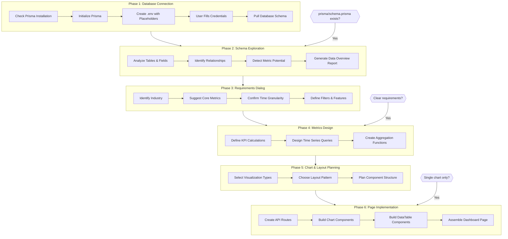

# BI Builder Skill

[](https://opensource.org/licenses/MIT)
[](https://claude.ai/code)
[](https://nextjs.org/)
[](https://www.prisma.io/)
[](https://recharts.org/)
[](https://ui.shadcn.com/)

A Claude Code skill for rapidly building BI dashboards and data visualization applications from existing databases.

## Features

- **6-Phase Workflow**: Database Connection → Schema Exploration → Requirements Dialog → Metrics Design → Chart Planning → Page Implementation
- **4 Layout Patterns**: Executive, Operational, Analytical, Comparison dashboards with complete templates
- **Industry-Specific Templates**: Pre-configured metrics for 7 industries (E-commerce, SaaS, Finance, Content, Education, Healthcare, Logistics)
- **Smart Skip Conditions**: Automatically skip phases based on project state
- **Progressive Document Loading**: Load reference docs on-demand to save context

## How It Works



## Tech Stack

| Layer | Technology |
|-------|------------|
| Frontend Framework | Next.js 16 (App Router) |
| UI Components | shadcn/ui + Tailwind CSS |
| Charts | Recharts |
| ORM | Prisma |
| Database | MySQL / PostgreSQL / Supabase / SQLite |

## Installation

```bash
# Install using npx skills (recommended)
npx skills add DangJin/bi-builder-skills

# Or manually clone and symlink
git clone https://github.com/DangJin/bi-builder-skills.git
ln -s $(pwd)/bi-builder-skills/skills/bi-builder ~/.claude/skills/bi-builder
```

## Usage

Trigger the skill in Claude Code by mentioning:
- "Create a data dashboard"
- "Build BI dashboard"
- "Generate sales analytics page"
- "Create data visualization charts"

## Project Structure

```
bi-builder-skills/
├── skills/
│   └── bi-builder/
│       ├── SKILL.md                 # Main skill file
│       └── references/
│           ├── data-layer.md        # Prisma queries & API design
│           ├── recharts-guide.md    # Chart type examples
│           ├── table-patterns.md    # DataTable patterns
│           ├── dashboard-patterns.md # Layout & component patterns
│           └── export-patterns.md   # CSV & image export
└── README.md
```

## Workflow Flexibility

| Scenario | Skip Phases | Starting Point |
|----------|-------------|----------------|
| Project has `prisma/schema.prisma` | Phase 1 | Go directly to schema analysis |
| User has clear requirements | Phase 3 | Go directly to metrics design |
| Only need a single chart | Phases 1-5 | Read recharts-guide.md |

## Industry Templates

| Industry | Core Metrics |
|----------|--------------|
| E-commerce/Retail | GMV, AOV, Repeat purchase rate, Return rate |
| SaaS Software | MRR/ARR, Churn Rate, LTV, CAC, DAU/MAU |
| Financial Services | AUM, Bad debt rate, Approval rate |
| Content/Media | PV/UV, Session duration, Ad revenue |
| Education | Course completion rate, Renewal rate |
| Healthcare | Visit volume, Bed turnover, Satisfaction |
| Logistics | Order fulfillment rate, Delivery time |

## Layout Patterns

| Layout | Best For | Key Features |
|--------|----------|--------------|
| **Executive Dashboard** | C-level, managers | KPI cards + main trend chart + distribution |
| **Operational Dashboard** | Operations team | Real-time status bar + live table + alerts |
| **Analytical Dashboard** | Analysts, data team | Sidebar filters + drill-down + detailed table |
| **Comparison Dashboard** | Strategy, planning | Period selector + dual charts + change analysis |

Each layout includes complete code templates with responsive design.

## Reference Documents

| Document | Content |
|----------|---------|
| `data-layer.md` | Prisma schema analysis, aggregation queries, API routes |
| `recharts-guide.md` | Line, Bar, Pie, Area, Composed, Scatter, Radar, Funnel charts |
| `table-patterns.md` | DataTable with sorting, filtering, pagination, row selection |
| `dashboard-patterns.md` | 4 layout patterns, KPI cards, filter bar, responsive grid |
| `export-patterns.md` | Client/server CSV export, html2canvas image export |

## License

[MIT](./LICENSE)
